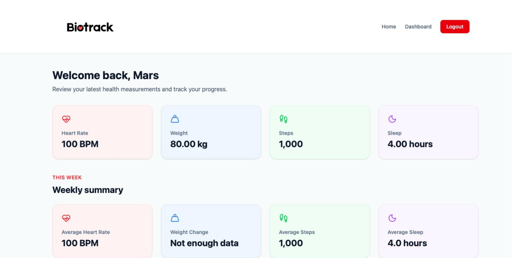
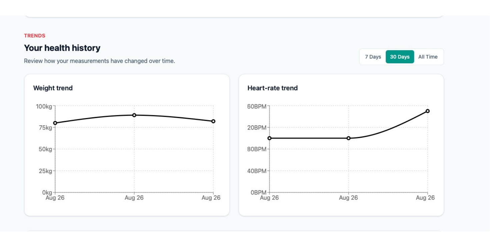
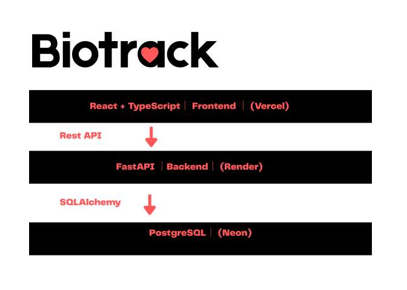

<p align="center">
  
</p>

### About

BioTrack is a full-stack health tracking application that gives users direct
control over their health records. Users can manually record and correct
metrics such as heart rate, weight, steps, and sleep, making it possible to
account for activity that wearable devices may miss.

BioTrack organizes these measurements into weekly, monthly, and all-time
trends through a personalized dashboard.

**Live Demo:** https://bio-track-amber.vercel.app



### Features

User registration and login
JWT-based authentication
Protected user-specific health data
Record heart rate, weight, steps, and sleep
Edit and delete previous health entries
View recent measurements
Weekly health summaries
Health trend visualization across multiple time ranges
Responsive dashboard and landing page
Persistent PostgreSQL data storage


### Frontend

React
TypeScript
Vite
Tailwind CSS
React Router
Lucide React
Recharts

### Backend

Python
FastAPI
SQLAlchemy
JWT authentication
pwdlib

### Database

PostgreSQL
Neon

### Deployment

Vercel — frontend
Render — FastAPI backend
Neon — PostgreSQL database

## Engineering Highlights

Designed a REST API with FastAPI using separate router, service, schema, and model layers.
Implemented JWT-based authentication and protected user-specific resources.
Built full CRUD operations for health records with PostgreSQL persistence.
Created responsive React dashboards with interactive health trend visualizations.
Configured separate development and production environments using environment variables and CORS restrictions.
Deployed the frontend, API, and database independently using Vercel, Render, and Neon.

## Architecture



Each authenticated user can access only the health records associated with their account. 

## Health Metrics

BioTrack currently supports tracking:

Heart rate (BPM)
Weight (kg)
Daily steps
Sleep duration (hours)

Users can create, view, update, and delete their health records.
The dashboard summarizes recent measurements and allows users to examine changes across different time periods.

## Authentication

BioTrack uses JWT-based authentication.

After a successful login, the backend issues an access token. Protected API requests send the token using the HTTP `Authorization` header.

```text
Authorization: Bearer <access_token>
```

Protected backend routes determine the authenticated user from the token before accessing user-specific data.

Passwords are stored as password hashes rather than plaintext passwords. An vital part of data encription. 

## API

The FastAPI backend provides endpoints for:

```text
POST   /users/register
GET    /users/me

POST   /auth/login

GET    /dashboard

POST   /health-metrics
GET    /health-metrics
PUT    /health-metrics/{metric_id}
DELETE /health-metrics/{metric_id}
```

FastAPI also provides interactive API documentation through Swagger UI.

## Running Locally

### 1. Clone the repository

```bash
git clone git clone https://github.com/Mars-shah/BioTrack.git
cd BioTrack
```

### 2. Backend

Move into the server directory:

```bash
cd server
```

Create and activate a virtual environment:

```bash
python3 -m venv venv
source venv/bin/activate
```

Install dependencies:

```bash
pip install -r requirements.txt
```

Create a `.env` file:

```env
DATABASE_URL=your_postgresql_connection_string
JWT_SECRET_KEY=your_secret_key
JWT_ALGORITHM=HS256
ACCESS_TOKEN_EXPIRE_MINUTES=30
FRONTEND_URL=http://localhost:5173
```

Start FastAPI:

```bash
uvicorn app.main:app --reload
```

The API will run at:

```text
http://127.0.0.1:8000
```

The backend separates API routes, schemas, database models, authentication dependencies, and business logic into dedicated modules.


### 3. Frontend

Open another terminal:

```bash
cd client
npm install
```

Create `client/.env`:

```env
VITE_API_URL=http://127.0.0.1:8000
```

Start the development server:

```bash
npm run dev
```

The frontend will normally run at:

```text
http://localhost:5173
```

## Security

BioTrack includes several basic security measures:

Password hashing
JWT authentication
Protected API endpoints
User-specific database queries
Environment variables for secrets and database credentials
CORS restrictions for approved frontend origins
Server-side request validation through FastAPI/Pydantic

No `.env` files or production secrets should be committed to the repository.

## Disclaimer

BioTrack is intended for personal health tracking and informational purposes only. It is not a substitute for professional medical advice, diagnosis, or treatment. 

_Created by Marut S. _